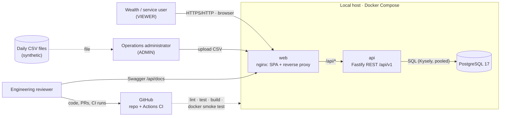
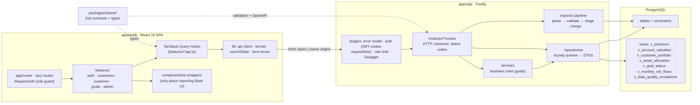
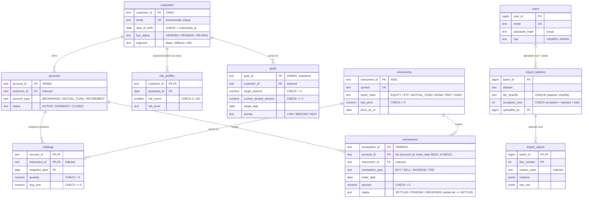
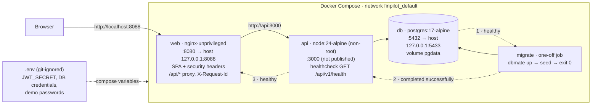
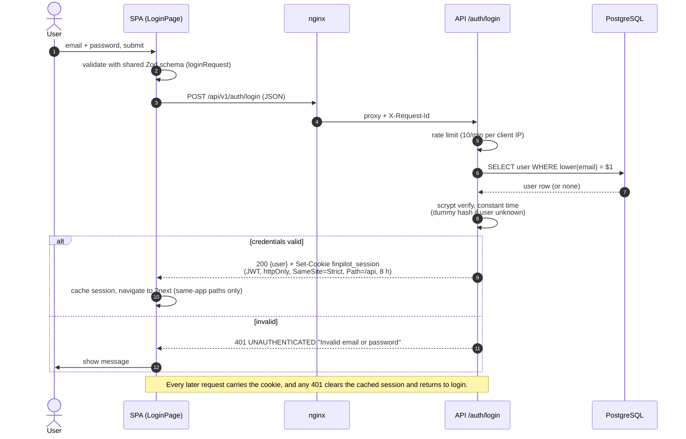
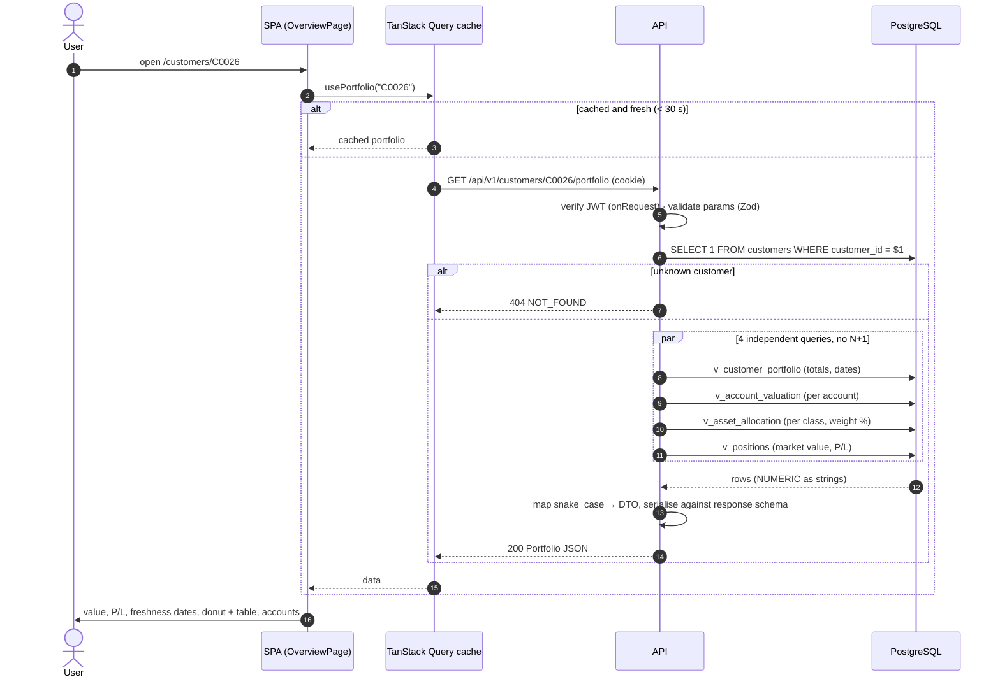
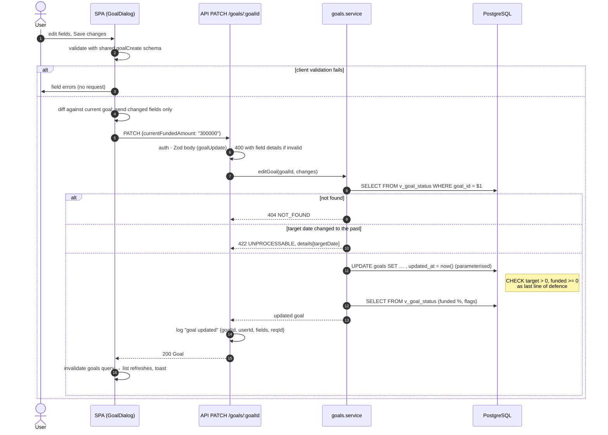
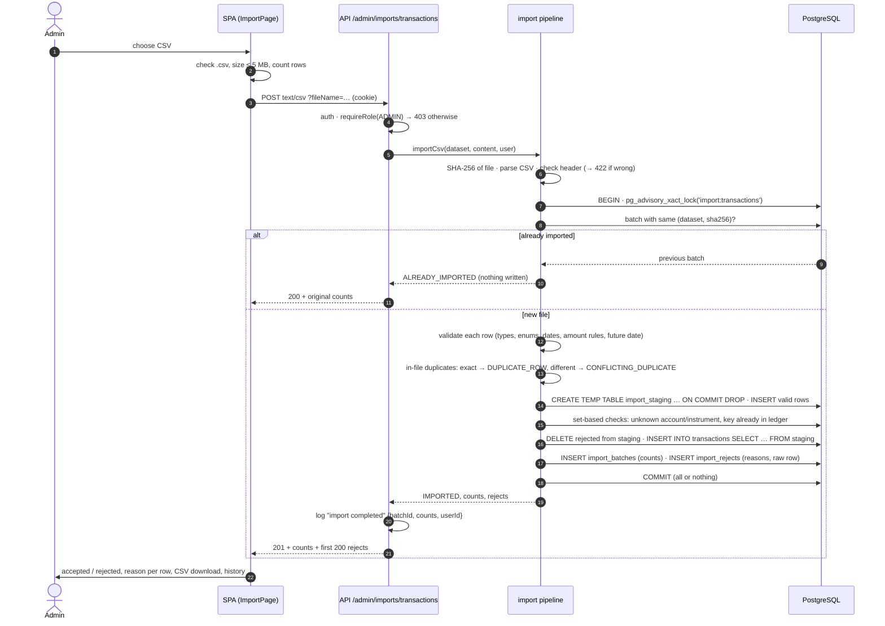
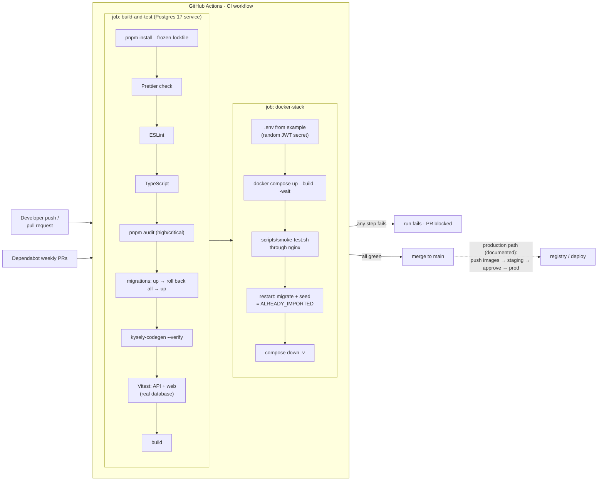

# Architecture diagrams

Mermaid sources for every diagram in the architecture report
([`../architecture-report.pdf`](../architecture-report.pdf)). GitHub renders them
below; `cd docs/report && npm install && npm run diagrams && npm run build && npm run pdf`
regenerates the PNGs and the report.

## System context

Source: [`system-context.mmd`](system-context.mmd)

## Components and data-access boundary

Source: [`components.mmd`](components.mmd)

## Entity-relationship diagram

Source: [`erd.mmd`](erd.mmd)

## Local deployment (Docker Compose)

Source: [`deployment.mmd`](deployment.mmd)

## Workflow: login

Source: [`seq-login.mmd`](seq-login.mmd)

## Workflow: customer portfolio read

Source: [`seq-portfolio.mmd`](seq-portfolio.mmd)

## Workflow: goal update

Source: [`seq-goal-update.mmd`](seq-goal-update.mmd)

## Workflow: CSV import

Source: [`seq-import.mmd`](seq-import.mmd)

## CI/CD pipeline

Source: [`cicd.mmd`](cicd.mmd)

